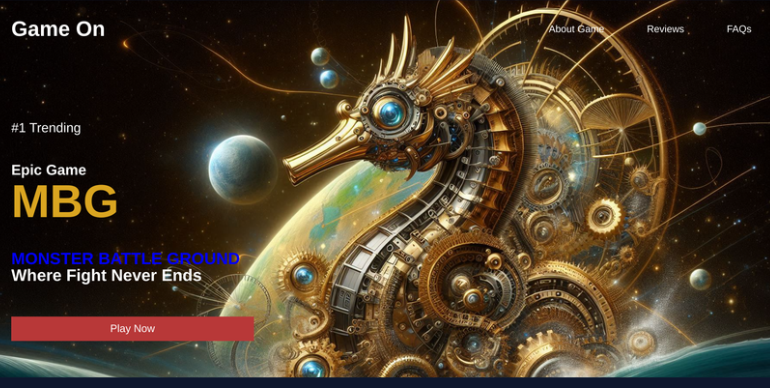
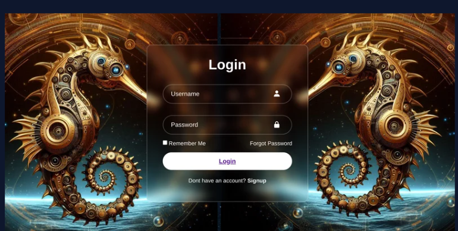
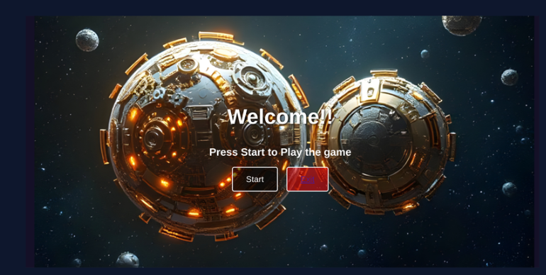
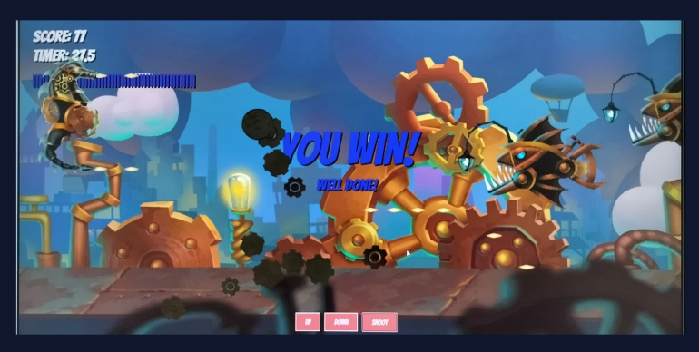

# Monster Battleground


A 2D side-scrolling shooter game built with vanilla JavaScript and the HTML5 Canvas API, wrapped in a custom landing page, signup and login screens, and a start menu.

This is my **first project**. The core game engine follows a YouTube tutorial (see [Credits](#credits)), and I designed and built the pages around it myself.

**Live demo:** [add your GitHub Pages link here]

---

## Screenshots

| Landing page | Signup / Login |
| :---: | :---: |
|  |  |

| Gameplay | Win screen |
| :---: | :---: |
|  |  |

---

## Features

**Game**
- Real-time 2D shooter with a `requestAnimationFrame` game loop
- Player movement and a projectile shooting system
- Multiple enemy types with sprite animation
- Collision detection between the player, projectiles and enemies
- Score, countdown timer and win / lose screens
- Parallax scrolling background layers
- Particle effects (gears, smoke, fire explosions)

**Pages I built**
- Landing page with an About Game section and a "Play Now" button
- Signup and login forms
- Welcome / start menu with Start and Exit buttons
- On-screen Up, Down and Shoot controls

> Remove any line above that is not in your code.

---

## Tech Stack

| Area | Technology |
| --- | --- |
| Language | JavaScript (ES6+) |
| Rendering | HTML5 Canvas API |
| Markup and styling | HTML5, CSS3 |
| Animation | `requestAnimationFrame` |

No frameworks or build tools are needed.

---

## Getting Started

1. Clone the repository:
   ```bash
   git clone https://github.com/Nikki03-tech/Monster-Battle-Ground-2D-Game-.git
   cd Monster-Battle-Ground-2D-Game-
   ```
2. Open `index.html` in your browser. For the most reliable results, use the **Live Server** extension in VS Code.

## Controls

| Action | Input |
| --- | --- |
| Move up / down | Arrow Up / Arrow Down, or the on-screen Up / Down buttons |
| Shoot | Space bar, or the on-screen Shoot button |

> Confirm these match your code.

---

## Project Structure

```
Monster-Battle-Ground-2D-Game-/
├── index.html        # Game page
├── script1.js        # Game logic
├── style.css         # Styling
├── *.png             # Sprites and background layers
├── screenshots/      # Images used in this README
└── README.md
```

Update this tree once the landing, signup and login pages are added.

---

## What I Built vs. What Came from the Tutorial

| Part | Source |
| --- | --- |
| Game loop, player, projectiles, enemies, collisions, sprite animation, particles | Followed the tutorial |
| Landing page, About section, signup page, login page, welcome / start menu | Designed and built by me |
| Game art and sprites | Free asset pack provided with the tutorial |

---

## Credits

- **Game tutorial and art assets:** [Frank's Laboratory](https://youtu.be/EvC3ge_puQk). Thank you for a clear, beginner-friendly tutorial. All rights to the original game code and art remain with their creator.
- **Landing-page and menu artwork:** [state where these images came from, for example an AI image generator or a stock site].

---

## What I Learned

- Building a game loop and controlling frame updates with `requestAnimationFrame`
- Object-oriented JavaScript with classes for the player, enemies and projectiles
- Rectangle collision detection (AABB)
- Sprite sheet animation and parallax backgrounds
- Designing multi-page UI flows: landing, signup, login and menus

## Roadmap

- [ ] Sound effects and background music
- [ ] Pause menu and settings
- [ ] Boss enemies
- [ ] Mobile touch support
- [ ] Connect signup and login to a backend for real accounts (currently front end only)

---

## Author

**Nikitha Singh Raj Purohit**
B.Tech CS&IT student | Aspiring Software Engineer and AI Engineer

[LinkedIn](https://www.linkedin.com/in/nikitha-singhraj-purohit-862317301) · [GitHub](https://github.com/Nikki03-tech)
